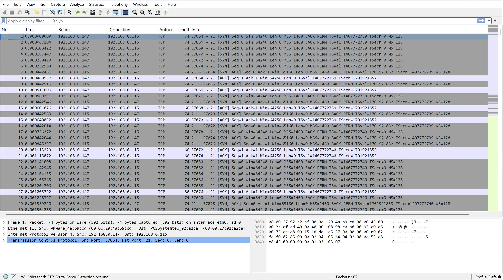
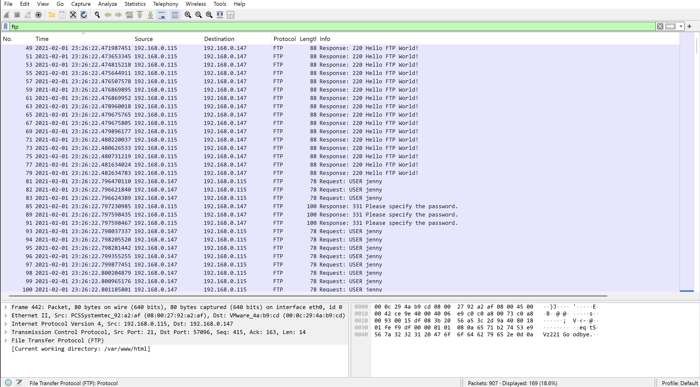
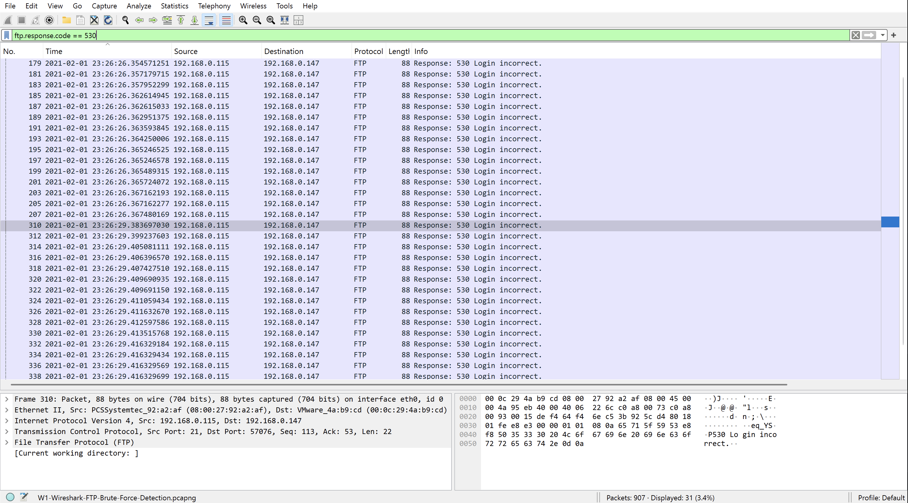
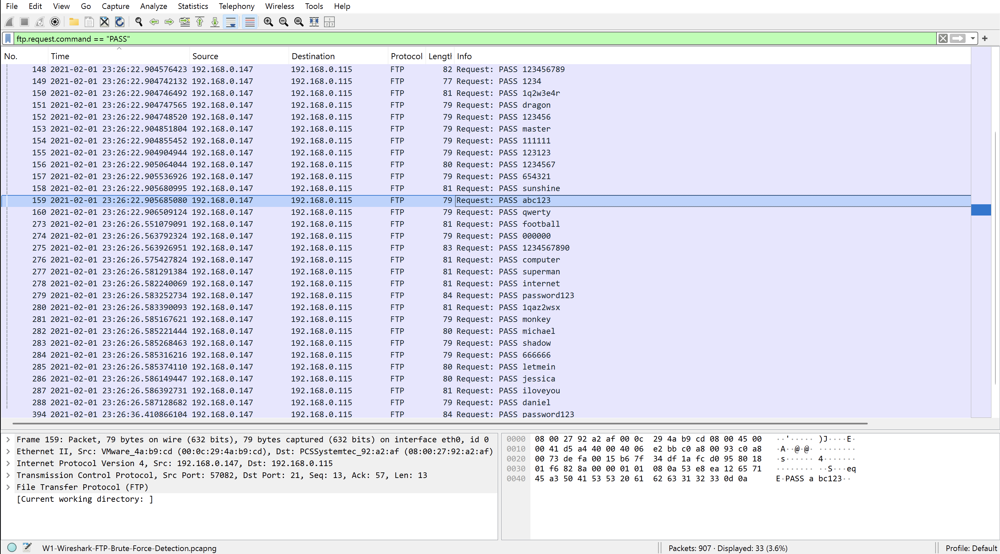
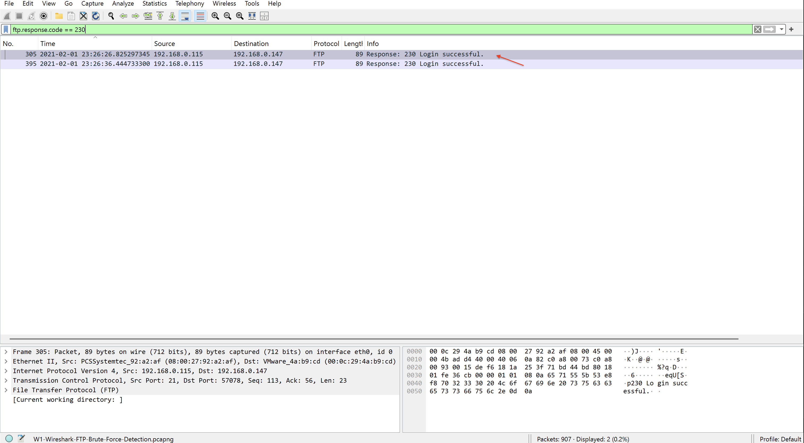
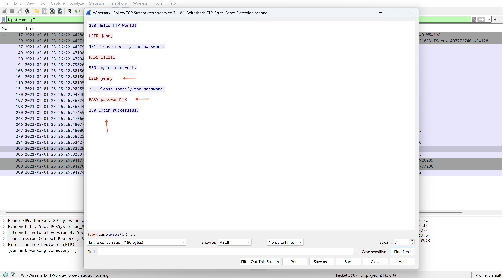

# Épisode 5 — Wireshark : Détection d'un Brute Force FTP

> L'attaquant, n'ayant pas réussi à obtenir `/passwords.pdf` via la reconnaissance web, change de tactique — analyse d'un brute force FTP contre **Buttercup Games** avec **Wireshark**.
 
---
 
## Table des matières
 
1. [Contexte](#1-contexte)
2. [Vue générale du trafic](#2-vue-générale-du-trafic)
3. [Détection du brute force — Tentatives répétées](#3-détection-du-brute-force--tentatives-répétées)
4. [Identification des échecs de connexion](#4-identification-des-échecs-de-connexion)
5. [Extraction des credentials tentés](#5-extraction-des-credentials-tentés)
6. [Connexion réussie — Credentials compromis](#6-connexion-réussie--credentials-compromis)
7. [MITRE ATT&CK Mapping](#7-mitre-attck-mapping)
8. [Conclusion](#8-conclusion)
9. [Réponse opérationnelle SOC](#9-réponse-opérationnelle-soc)
---
 
## 1. Contexte

N'ayant pas réussi à récupérer le fichier `/passwords.pdf` via la reconnaissance web, l'attaquant change de tactique. Il cible directement un compte utilisateur du serveur FTP de Buttercup Games avec une attaque par brute force.

Suite à cette série d'incidents, **Buttercup Games** a mandaté un audit de sécurité interne. 

Cet audit a mis en évidence l'utilisation du protocole **FTP non chiffré** sur plusieurs serveurs — 
une vulnérabilité connue permettant l'interception des credentials en clair. 

La migration vers **FTPS** était planifiée mais pas encore déployée au moment de l'attaque.

L'hypothèse retenue par le SOC : l'attaquant a obtenu le nom d'utilisateur `jenny` par un moyen non encore déterminé — possiblement un ancien accès non révoqué ou une connaissance interne de l'organisation.
 
---
 
## 2. Vue générale du trafic
 
On commence par ouvrir le fichier dans Wireshark sans aucun filtre pour avoir une vue d'ensemble du trafic.
 
[](1.png)
 
Le fichier contient **907 paquets**. Le protocole dominant est **TCP**, avec une forte présence de trafic **FTP** sur le **port 21**.
 
> ⚠️ Le protocole FTP transmet les données **en clair**, y compris les identifiants et mots de passe. C'est l'une des raisons pour lesquelles il est considéré comme non sécurisé et remplacé par SFTP ou FTPS dans les environnements modernes.
 
---
 
## 3. Détection du brute force — Tentatives répétées
 
On applique un premier filtre pour isoler uniquement le trafic FTP :
 
```
ftp
```
 
[](2.png)
 
La colonne **Info** révèle immédiatement de nombreuses commandes `USER` et `PASS` répétées — signature caractéristique d'une attaque par brute force. L'attaquant teste méthodiquement une liste de combinaisons identifiant/mot de passe.
 
---
 
## 4. Identification des échecs de connexion
 
On affine le filtre pour ne voir que les tentatives de connexion échouées :
 
```
ftp.response.code == 530
```
 
[](3.png)
 
Le code **530** correspond au message **"Login incorrect"**. Chaque paquet avec ce code représente une tentative ratée.
 
| Code FTP | Signification |
|----------|--------------|
| 530 | Login incorrect — credentials invalides |
| 230 | Login successful — connexion réussie |
| 331 | Username OK, password required |
 
> ⚠️ La répétition massive de codes 530 en peu de temps est un indicateur fiable d'une attaque par brute force automatisée ou semi-automatisée.
 
---
 
## 5. Extraction des credentials tentés
 
On filtre sur les commandes `PASS` pour voir tous les mots de passe testés :
 
```
ftp.request.command == "PASS"
```
 
[](4.png)
 
La liste des mots de passe tentés est visible en clair dans la colonne **Info**. C'est la preuve directe que FTP ne chiffre pas les échanges — n'importe qui sur le réseau peut intercepter ces données.
 
---
 
## 6. Connexion réussie — Credentials compromis
 
On filtre sur le code de succès pour identifier le moment exact de la compromission :
 
```
ftp.response.code == 230
```
 
[](5.png)
 
Deux connexions réussies sont détectées :
 
| Élément | Valeur |
|---------|--------|
| Date et heure | 2021-02-01 à 23:26:26 |
| IP source (attaquant) | 192.168.0.115 |
| IP destination (serveur FTP) | 192.168.0.147 |
| Code de retour | 230 — Login successful |
 
Pour reconstruire la conversation complète, on utilise **Follow TCP Stream** sur la session réussie :
 
[](6.png)
 
La session révèle clairement la séquence de l'attaque :
 
| Étape | Commande | Réponse |
|-------|----------|---------|
| 1ère tentative | `USER jenny` / `PASS 111111` | `530 Login incorrect` |
| 2ème tentative | `USER jenny` / `PASS password123` | `230 Login successful` |
 
> ❌ **L'attaquant a trouvé les credentials valides en moins de 15 secondes.** Le mot de passe `password123` figure systématiquement dans les wordlists de brute force comme `rockyou.txt`. Le compte `jenny` est compromis depuis le **2021-02-01 à 23:26:26**.
 
---
 
## 7. MITRE ATT&CK Mapping
 
| Technique | ID | Description |
|-----------|-----|-------------|
| Brute Force | T1110 | Tentatives massives de connexion FTP avec wordlist |
| Valid Accounts | T1078 | Utilisation des credentials jenny:password123 |
 
---
 
## 8. Conclusion
 
> 🔴 **Le compte `jenny` a été compromis le 2021-02-01 à 23:26:26.**
 
| Étape | Constat |
|-------|---------|
| Brute force FTP détecté | ❌ Multiples codes 530 en quelques secondes |
| Credentials compromis | ❌ jenny / password123 |
| Heure de compromission | ⚠️ 2021-02-01 à 23:26:26 |
| IP de l'attaquant | ⚠️ 192.168.0.115 |

La compromission du compte `jenny` n'est que le début. L'investigation se poursuit dans l'Épisode 2 pour déterminer ce que l'attaquant a fait après la connexion réussie.

---
 
## 9. Réponse opérationnelle SOC
 
### 🚧 Confinement immédiat
 
- Désactiver le compte `jenny` immédiatement
- Bloquer l'IP `192.168.0.115` au niveau du pare-feu
- Isoler le serveur FTP du réseau
### 📋 Escalade
 
- Documenter la compromission avec la date, l'heure et les credentials exposés
- Transmettre le rapport à l'équipe N2 pour investigation approfondie
- Vérifier si d'autres comptes ont été ciblés sur le même serveur
### 🔔 Détection
 
- Créer une alerte sur les codes 530 répétés en moins de 60 secondes
- Remplacer FTP par SFTP ou FTPS pour chiffrer les échanges
### 🛡️ Recommandations
 
- Interdire les mots de passe faibles — politique de mots de passe obligatoire
- Mettre en place un compte lockout après N tentatives échouées
- Désactiver FTP et migrer vers SFTP
---
 
## 📁 Reproduire cette analyse

Le fichier `.pcapng` utilisé est disponible sur **TryHackMe** dans la room **[h4cked](https://tryhackme.com/room/h4cked)**.
Un compte TryHackMe gratuit suffit pour y accéder.

---

*© Paulcyber06 — Tous droits réservés.*
